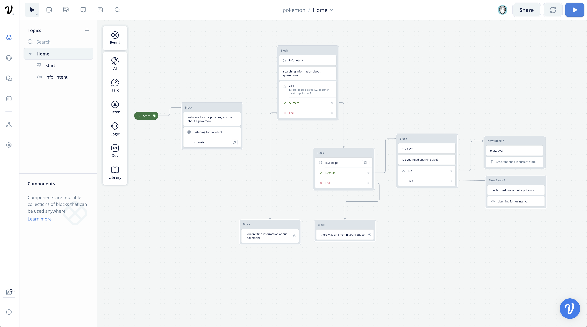
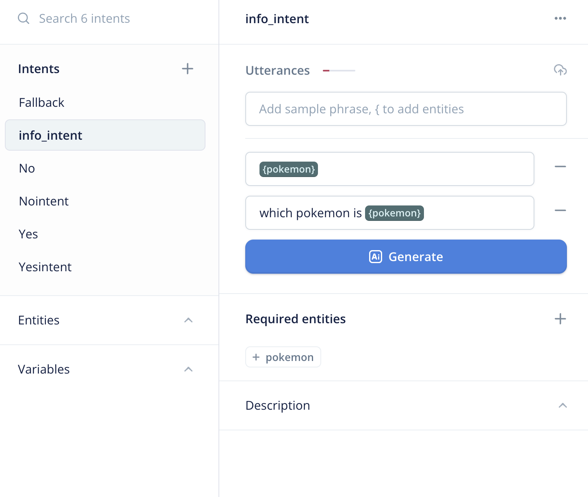
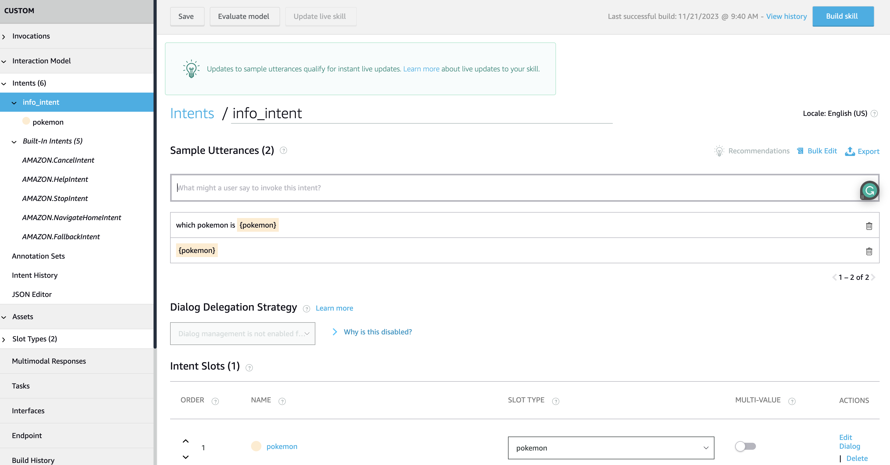
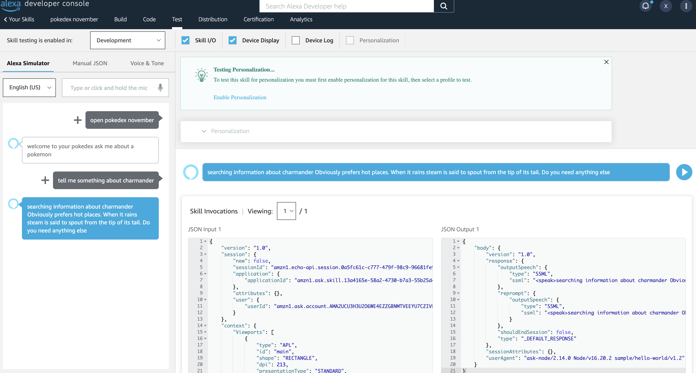

# Integrate Alexa with Voiceflow

<!-- TOC -->

- [Integrate Alexa with Voiceflow](#integrate-alexa-with-voiceflow)
  - [Prerequisites](#prerequisites)
  - [Introduction](#introduction)
  - [Voiceflow Project](#voiceflow-project)
    - [NLU](#nlu)
    - [Dialog Manager API](#dialog-manager-api)
  - [Alexa Skill](#alexa-skill)
    - [NLU](#nlu-1)
    - [Lambda Code](#lambda-code)
  - [Testing](#testing)
  - [Conclusion](#conclusion)

<!-- /TOC -->

## Prerequisites
1. You need to have an account on [Voiceflow](https://www.voiceflow.com/)
2. You need to have an account on [Alexa Developer](https://developer.amazon.com/alexa)
3. Node.js and npm/yarn installed on your computer

## Introduction
Alexa has a lot of capabilities, but it is not easy to create a complex conversation. Voiceflow is a tool that allows you to create complex conversations with Alexa without writing code. This integration allows you to create a conversation in Voiceflow and then deploy it to Alexa.

Because of that, In this repository you will find a simple example of how to integrate Alexa with Voiceflow using the Alexa Skills Kit SDK for Node.js and calling the Voiceflow's Dialog Manager API.


## Voiceflow Project

On Voiceflow, you will need to create a project and create a conversation. You can follow the [Voiceflow Quick Start](https://learn.voiceflow.com/hc/en-us/articles/15965489787789-Step-1-Create-a-Project) to create a simple conversation. On Voiceflow the only thing that you have to care about is to design the conversation. 

In this example, we are going to create a simple conversation that asks the user for information about pokemons. The conversation will be like this:



### NLU

Voiceflow has a built-in NLU, since we are going to call Voiceflow using the Dialog Manager API, we will need to design our NLU on Voiceflow and on Alexa.

Following the example, we are going to create an intent called `info_intent` and a slot called `pokemon` that will be filled with the name of the pokemon that the user wants to know about:



### Dialog Manager API

The Dialog Manager API is a REST API that allows you to interact with Voiceflow. You can find the documentation [here](https://www.voiceflow.com/api/dialog-manager).

The DM API automatically creates and manages the conversation state. Identical requests to the DM API may produce different responses depending on your diagram's logic and the previous request that the API received.

The DM API endpoints is:

```
https://general-runtime.voiceflow.com/state/user/{userID}/interact
```

There are different types of requests that can be sent. To see a list of all request types, check out the documentation for the action field below.

To start a conversation, you should send a launch request. Then, to pass in your user's response, you should send a text request. If you have your own NLU matching, then you may want to directly send an intent request.

Here you have an example of a request:

```json
curl --request POST \
     --url 'https://general-runtime.voiceflow.com/state/user/{userID}/interact?logs=off' \
     --header 'accept: application/json' \
     --header 'content-type: application/json' \
     --header 'Authorization: VF.DM.96ds3423ds9423fs87492fds79792gf343' \
     --data '
{
  "action": {
    "type": "launch"
  },
  "config": {
    "tts": false,
    "stripSSML": true,
    "stopAll": true,
    "excludeTypes": [
      "block",
      "debug",
      "flow"
    ]
  }
}
'
```

As you can see, you need to pass the `userID` and the `Authorization` header. The `userID` is the user id that you want to interact with. The `Authorization` header is the API key that you can find on the Voiceflow project settings.

You can find the Voiceflow project that I used for this example [here](./voiceflow/project.vf).

## Alexa Skill

To create an Alexa Skill you need to go to [Alexa Developer](https://developer.amazon.com/alexa) and create a new skill. You can follow the [Alexa Developer Console Quick Start](https://developer.amazon.com/en-US/docs/alexa/alexa-skills-kit-sdk-for-nodejs/develop-your-first-skill.html) to create a simple skill.

### NLU

We will need to replicate the Voiceflow NLU (intents and entities) in our Alexa Skill:



As you can see, we are using the `SearchQuery` type. This type is used to get the user input and send it directly to Voiceflow. You can find more information about this type [here](https://developer.amazon.com/en-US/docs/alexa/custom-skills/slot-type-reference.html#searchquery).

### Lambda Code

The Alexa Skill Code is going to be generic, that means that this Alexa Skill Code can be used with any Voiceflow project. To do that, we are going to implement a Lambda function that will call the Voiceflow Dialog Manager API. We are going to use the Alexa Skills Kit SDK for Node.js and Axios to call the API.

We will need to touch only 2 handlers, the `LaunchRequestHandler` and the `ListenerIntentHandler`. The `LaunchRequestHandler` will be used to start the conversation and the `ListenerIntentHandler` will be used to send the user input to Voiceflow.

Let's start with the `LaunchRequestHandler`:

```javascript
const LaunchRequestHandler = {
    canHandle(handlerInput) {
        return Alexa.getRequestType(handlerInput.requestEnvelope) === 'LaunchRequest';
    },
    async handle(handlerInput) {

        let chatID = Alexa.getUserId(handlerInput.requestEnvelope).substring(0, 8);
        const messages = await utils.interact(chatID, {type: "launch"});

        return handlerInput.responseBuilder
            .speak(messages.join(" "))
            .reprompt(messages.join(" "))
            .getResponse();
    }
};
```

This Handler is called when the skill is launched. We are going to get the user id and call the Voiceflow Dialog Manager API with the `launch` action. Then, we are going to return the response.

The following interactions are going to be handled by the `ListenerIntentHandler`:
```javascript
const ListenerIntentHandler = {
    canHandle(handlerInput) {
        return Alexa.getRequestType(handlerInput.requestEnvelope) === 'IntentRequest'
    },
    async handle(handlerInput) {

        let chatID = Alexa.getUserId(handlerInput.requestEnvelope).substring(0, 8);
        const intent = Alexa.getIntentName(handlerInput.requestEnvelope);
        const entitiesDetected = utils.alexaDetectedEntities(handlerInput.requestEnvelope);

        const request = { 
            type: "intent", 
            payload: { 
                intent: {
                    name: intent
                },
                entities: entitiesDetected
            }
        };

        const messages = await utils.interact(chatID, request);

        return handlerInput.responseBuilder
            .speak(messages.join(" "))
            .reprompt(messages.join(" "))
            .getResponse();
    }
};
```

This Handler is called when the user says something. We are going to get the user input and call the Voiceflow Dialog Manager API with the `intent` action. Since the NLU Inferece is done by Alexa, we need to get the detected entities and the detected intents and send them to Voiceflow. Then, we are going to return the response.

To get the detected entities, we are going to use the following function:

```javascript
module.exports.alexaDetectedEntities = function alexaDetectedEntities(alexaRequest) {
    let entities = [];
    const entitiesDetected = alexaRequest.request.intent.slots;
    for ( const entity of Object.values(entitiesDetected)) {
        entities.push({
            name: entity.name,
            value: entity.value
        });
    }
    return entities;
}
```

You can find the code of this function [here](./lambda/utils.js).

Finally we have to make sure that we add the handlers to the skill:

```javascript
exports.handler = Alexa.SkillBuilders.custom()
    .addRequestHandlers(
        LaunchRequestHandler,
        ListenerIntentHandler,
        HelpIntentHandler,
        CancelAndStopIntentHandler,
        FallbackIntentHandler,
        SessionEndedRequestHandler,
        IntentReflectorHandler)
    .addErrorHandlers(
        ErrorHandler)
    .withCustomUserAgent('sample/hello-world/v1.2')
    .lambda();
```

In the handlers above you can see that we are using a function called `utils.interact`. This function is going to call the Voiceflow Dialog Manager API. You can find the code of this function [here](./lambda/utils.js):
    
```javascript
const axios = require('axios');

const VF_API_KEY = "VF.DM.96ds3423ds9423fs87492fds79792gf343";

module.exports.interact = async function interact(chatID, request) {
    let messages = [];
    console.log(`request: `+JSON.stringify(request));

    const response = await axios({
        method: "POST",
        url: `https://general-runtime.voiceflow.com/state/user/${chatID}/interact`,
        headers: {
            Authorization: VF_API_KEY
        },
        data: {
            request
        }

    });

    for (const trace of response.data) {
        switch (trace.type) {
            case "text":
            case "speak":
                {
                    // remove break lines
                    messages.push(this.filter(trace.payload.message));
                    break;
                }
            case "end":
                {
                    messages.push("Bye!");
                    break;
                }
        }
    }

    console.log(`response: `+messages.join(","));
    return messages;
};
```
This function is going to return an array of messages. We are going to use this array to build the response. We have also added some code to remove the break lines and weird characters:
    
```javascript
module.exports.filter = function filter(string) {
    string = string.replace(/\&#39;/g, '\'')
    string = string.replace(/(<([^>]+)>)/ig, "")
    string = string.replace(/\&/g, ' and ')
    string = string.replace(/[&\\#,+()$~%*?<>{}]/g, '')
    string = string.replace(/\s+/g, ' ').trim()
    string = string.replace(/ +(?= )/g,'')

	return string;
};
```

With this code, we have finished the Alexa Skill. You can find the code of the Lambda function [here](./lambda/index.js).

## Testing

Once you have created the Alexa Skill and the Voiceflow project, you can test it. To test it, you can use the Alexa Simulator or you can use a real device.

Following the example we were using, you can test the Alexa Skill with the following sentences to request information about pokemons:



## Conclusion

As you can see, it is very easy to integrate Alexa with Voiceflow. You can create complex conversations with Voiceflow and then deploy them to Alexa. So your focus will be on the conversation and not on the code!

I hope you have enjoyed this tutorial. 

Happy coding!
